# 🏙️ **UrbanSphere — High-Level Architecture Overview**
A modern **cloud-native**, **event-driven**, and **microservices-based** Smart Mobility & City Safety platform.  
Designed for **real-time telemetry**, **routing**, **traffic intelligence**, **hazard detection**, and **community safety** at massive scale.

Built using:

- **Java 21**, **Spring Boot 3**
- **Kafka (Amazon MSK)**
- **Postgres (RDS Multi-AZ)**
- **Redis (ElastiCache)**
- **Object storage (S3)**
- **EKS (Kubernetes)**
- Strict microservice/domain boundaries
- Strong security with IAM, KMS, WAF, mTLS

---

# 🎯 **1. Architecture Goals**

## ✅ Functional Goals
- User authentication & RBAC
- Real-time GPS ingestion
- Routing & traffic computation
- Hazard detection & safety workflows
- Push/SMS/Email notifications
- Community (“society”) features
- Analytics & historical insights

## 🎛️ Non-Functional Goals
- **High Availability** → 99.9% for critical APIs
- **Low Latency** → p95 < 300ms
- **Scalability** → 100K+ GPS events/sec
- **Durability** → Multi-AZ Postgres, Kafka, S3
- **Security** → IAM isolation, KMS encryption, mTLS
- **Observability** → Metrics, logs, traces

---

# 🏗️ **2. System Architecture (High-Level)**

```mermaid
flowchart LR

subgraph Clients
    C[Mobile/Web Clients]
    IoT[IoT Devices / GPS Trackers]
end

C -->|HTTPS / WebSocket| ALB[Amazon ALB + WAF]
IoT -->|HTTP / MQTT / gRPC| ALB

ALB --> APIGW[API Gateway (EKS)]

subgraph EKS[Microservices on Amazon EKS]
    Auth[auth-service]
    User[user-service]
    Location[location-service]
    Routing[routing-service]
    Traffic[traffic-service]
    Safety[safety-service]
    Notification[notification-service]
    Society[society-service]
    Analytics[analytics-worker]
end

APIGW --> Auth
APIGW --> User
APIGW --> Location
APIGW --> Routing
APIGW --> Safety
APIGW --> Traffic
APIGW --> Notification
APIGW --> Society

subgraph MSK[Kafka Cluster (Amazon MSK)]
    DL[(device.location.v1)]
    HR[(hazard.report.v1)]
    RU[(routing.request.v1)]
    UA[(user.activity.v1)]
end

Location --> DL
Safety --> HR
Routing --> RU
User --> UA

DL --> Traffic
DL --> Safety
DL --> Analytics
HR --> Notification
HR --> Analytics

subgraph Storage[Persistent Storage Layer]
    RDS[(Postgres - Multi AZ)]
    Redis[(Redis Cache)]
    S3[(Object Storage)]
end

Auth --> RDS
User --> RDS
Traffic --> RDS
Safety --> RDS

Routing --> Redis

EKS --> S3
```

---

# 🧩 **3. Architectural Layers**

UrbanSphere is divided into distinct layers for security, scalability, and modularity.

---

## 🔹 **3.1 Edge Layer**

### Components
- **AWS ALB** (Application Load Balancer)
- **AWS WAF** (Firewall)
- **ACM Certificates** (TLS termination)

### Responsibilities
- First entry point
- Enforce HTTPS
- Layer-7 intelligent routing
- DDoS & Bot mitigation
- Optional IP/geo filtering

---

## 🔹 **3.2 API Gateway Layer (EKS)**
A lightweight gateway without business logic.

### Responsibilities
- JWT validation (public JWK from Auth)
- Rate limiting
- Routing to microservices
- API versioning
- Fast timeouts & fallback

### Non-Responsibilities
❌ No business logic  
❌ No storage  
❌ No external API calls

---

## 🔹 **3.3 Microservices Layer (Spring Boot 3)**

Every service:
- Owns its **data schema**
- Emits/consumes **Kafka events**
- Runs in isolated **Kubernetes pods**
- Uses **OpenTelemetry instrumentation**

### **Domain Services Overview**

| Service | Responsibilities |
|--------|------------------|
| **auth-service** | Login, register, JWT issuance, refresh tokens, RBAC |
| **user-service** | Profile, privacy, devices, preferences |
| **location-service** | GPS ingestion, normalization, publishing telemetry |
| **traffic-service** | Congestion modeling, segment speeds, anomaly checks |
| **routing-service** | Route computation, caching, hazard-aware routing |
| **safety-service** | Accident/hazard reports, classification |
| **notification-service** | Push, SMS, email delivery |
| **society-service** | Communities, societies, public posts |
| **analytics-worker** | Offline analytics, ETL, batch jobs |

---

# 🚦 **4. Event-Driven Backbone (Kafka / MSK)**

Kafka is the **central nervous system** of UrbanSphere.

### Benefits
- High-throughput stream ingestion
- Ordering guarantees per device
- Fan-out to multiple consumers
- Replay for ML & analytics
- Decouples microservices

### Kafka Topics

| Topic | Purpose | Key |
|-------|---------|-----|
| **device.location.v1** | Real-time GPS stream | `deviceId` |
| **hazard.report.v1** | Accident/hazard reports | `hazardId` |
| **routing.request.v1** | Routing request logs | `requestId` |
| **user.activity.v1** | User audit trail | `userId` |

---

## Kafka Flow Diagram


---

# 🗄️ **5. Storage Architecture**

## 🔵 **Postgres (RDS – Multi-AZ)**
Used for durable relational workloads:

- Users
- Hazards
- Traffic aggregates
- Society data
- Device metadata
- Tokens (optional — Redis recommended)

---

## 🔴 **Redis Cache (ElastiCache)**
Used for:

- Cached routes
- Throttling counters
- Recent location snapshots
- Transient/session-like values

---

## 🟡 **S3 Object Storage**

Stores:

- Raw telemetry dumps
- Analytics snapshots
- Machine learning datasets
- File attachments (reports, images, etc.)

---

# 🔐 **6. Security Architecture**

```mermaid
flowchart TB
User --> ALB[ALB + TLS + WAF]

subgraph AuthLayer[Authentication & IAM Controls]
    JWT[RS256 JWT Validation]
    RBAC[Role-Based Access Control]
    KMS[KMS – Private Key Storage]
end

ALB --> JWT
JWT --> Services[Microservices]

Services --> RDS
Services --> Kafka
Services --> Redis

Services --> IRSA[IAM Roles for Service Accounts]
```



### Security Principles
- TLS everywhere
- RS256 JWT with key rotation
- Private keys stored in KMS
- IRSA to restrict AWS permissions
- Kafka SASL/IAM authentication
- RDS/MSK encrypted at rest
- WAF blocking OWASP threats

---

# 📊 **7. Observability Architecture**

## 🔍 Tracing
- OpenTelemetry + OTel SDK
- `trace_id` propagated via HTTP + Kafka
- Export to **AWS X-Ray / Jaeger**

## 📈 Metrics
Collected via Micrometer → Prometheus → Grafana:

- HTTP latency
- Kafka consumer lag
- DB query performance
- Redis cache hit rate
- Error spikes

## 📝 Logging
- JSON structured logs
- Log correlation with `trace_id`
- Shipped to CloudWatch / ELK

---

# 🚢 **8. Deployment & Infrastructure**

## Infrastructure Components
- **Amazon EKS** (Microservices)
- **Amazon MSK** (Kafka)
- **Amazon RDS** (Postgres)
- **ElastiCache Redis**
- **S3 Storage**
- **CloudWatch + Prometheus + Grafana**
- **ArgoCD GitOps**
- **GitHub Actions CI/CD**

---

## CI/CD Flow

```mermaid
flowchart LR
Dev[Developer Commit] --> GH[GitHub Actions]
GH --> Build[Build + Test]
Build --> ECR[ECR (Docker Images)]
ECR --> Argo[ArgoCD (GitOps Sync)]
Argo --> EKS[EKS Deployment]
```

---

# 🧾 **9. Summary**

UrbanSphere is a **distributed, real-time, event-driven platform** that combines:

- 🧩 Microservices (EKS)
- ⚡ Kafka (MSK) Streaming
- 🗄️ Postgres, Redis, S3 Storage
- 🔐 Security (WAF, IAM, KMS, mTLS)
- 🔎 Observability (OTel, Prometheus, Grafana)
- 🚦 Core Mobility Intelligence (routing, traffic, hazards)

It is engineered for **scalability**, **reliability**, **fault-tolerance**, and **developer clarity** to meet the challenges of modern smart cities.

---
